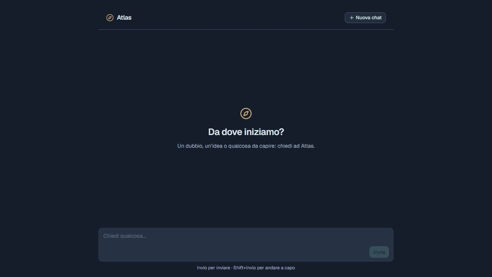

# Atlas — assistente AI locale

Il progetto contiene il backend Node.js per un assistente Ollama locale. Il frontend React / Next.js è nella cartella `frontend`, accanto a `backend`.

Il progetto nasce come esercizio per imparare a costruire un frontend per applicazioni AI, collegandolo a un modello locale senza API a pagamento.

**Progetto di apprendimento in sviluppo**, pensato per essere eseguito sul proprio computer. Le risposte sono generate da Ollama; il tool meteo richiede Internet e invia la città richiesta a Open-Meteo.



## Stato attuale

- Chat con messaggi utente e assistente, gestiti con Redux Toolkit.
- Invio della cronologia al backend tramite una Route Handler Next.js (BFF).
- Risposta completa dell'assistente, senza streaming nel frontend.
- Bolla temporanea con puntini animati durante la generazione e invio disabilitato durante l'attesa.
- Banner di errore richiudibile.
- Tool MCP per conoscere l'ora e il meteo.

I messaggi restano in memoria: ricaricando la pagina si perde la conversazione. Il backend supporta già lo streaming SSE, ma la chat usa attualmente `stream: false`. Il pulsante “Nuova chat” è presente ma non è ancora collegato a un'azione; Markdown e gestione di più conversazioni sono da implementare.

## Architettura

```text
Browser / chat Next.js (:3000)
  → POST /api/chat sul BFF Next.js
  → POST /api/chat sul backend Node.js (:3001)
  → Ollama e tool MCP
```

Il browser chiama il BFF sulla stessa origine. L'indirizzo del backend è configurato sul server Next.js tramite `BACKEND_URL`.

```text
Atlas-locale/
  backend/    # API Node.js, tool MCP, configurazione e test
  frontend/   # Chat Next.js, stato Redux Toolkit e BFF
```

## Avvio backend

Prerequisiti: Node.js 22 o successivo, npm e Ollama con il modello indicato nella configurazione del backend. Consultare [backend/.env.example](backend/.env.example) per le variabili disponibili.

Installare il modello predefinito con `ollama pull qwen3:14b`. Verificare di avere risorse sufficienti per eseguirlo, oppure configurare un altro modello che supporti i tool.

Ollama deve essere in esecuzione. Se non è già avviato tramite l'app, aprire un terminale separato:

```sh
ollama serve
```

Eseguire dalla cartella principale:

```sh
cd backend
npm ci
npm run dev
```

L'API ascolta su `http://127.0.0.1:3001`. Avviare Ollama separatamente per generare risposte. Per la versione terminale usare `npm run dev:cli` dalla cartella `backend`.

Per personalizzare la configurazione, copiare `backend/.env.example` in `backend/.env` prima dell'avvio. Senza questo file, il backend usa i valori predefiniti dell'esempio.

## Frontend

Prima dell'avvio, copiare `frontend/.env.example` in `frontend/.env.local`: la variabile `BACKEND_URL` è necessaria per collegarsi al backend. Aprire un altro terminale nella cartella principale `Atlas-locale` e avviare il frontend:

```sh
cd frontend
npm ci
npm run dev
```

Il frontend usa la porta 3000 e il backend la porta 3001. Per un nuovo checkout, eseguire `npm ci` nella cartella `frontend`. Configurare `frontend/.env.local` con `BACKEND_URL=http://127.0.0.1:3001` e riavviare il frontend dopo le modifiche alla configurazione.

Aprire [http://localhost:3000](http://localhost:3000) nel browser. Non aggiungere `frontend/.env.local` al repository.

## Verifica e problemi comuni

- `GET http://127.0.0.1:3001/api/health` permette di controllare lo stato di Ollama e del modello. HTTP 200 indica che il backend è raggiungibile: controllare anche i campi `status` e `ollama`.
- In caso di errore 502, verificare che Ollama sia avviato e che il modello configurato sia installato.
- Nel pannello Network del browser compare la richiesta a Next.js `/api/chat`; la chiamata da Next.js a Node avviene sul server.

Controlli backend, dalla cartella `backend`:

```sh
npm run typecheck
npm test
npm run build
```

Controlli frontend, dalla cartella `frontend`:

```sh
npm run lint
npm run build
```

## Dati e uso locale

L'API backend ascolta sul loopback e non ha autenticazione: è pensata per uso locale, non per essere esposta su Internet. Rendere pubblico il codice non richiede di pubblicare un'istanza dell'applicazione.

Non aggiungere a Git credenziali, conversazioni o dati personali. Il server sperimentale dei promemoria salva in `backend/data/reminders.json`; questa cartella è esclusa dal repository. I promemoria non sono collegati alla chat web attuale.

## Licenza

Il codice originale di Atlas è distribuito con licenza [ISC](LICENSE). Le dipendenze e il modello Ollama utilizzato mantengono le rispettive licenze.

## Prossimi passi

- Streaming delle risposte nella chat.
- Collegare il pulsante “Nuova chat” all'azzeramento della conversazione.
- Pulsante Stop per annullare la generazione.
- Riprova dopo un errore senza duplicare il messaggio utente.
- Rendering Markdown e blocchi di codice.
- Cronologia di più conversazioni con persistenza locale.

Il contratto API e le istruzioni dettagliate sono in [backend/README.md](backend/README.md). Le specifiche precedenti sono conservate in [backend/specifiche-atlas-locale.md](backend/specifiche-atlas-locale.md); i loro percorsi si riferiscono alla cartella backend.
